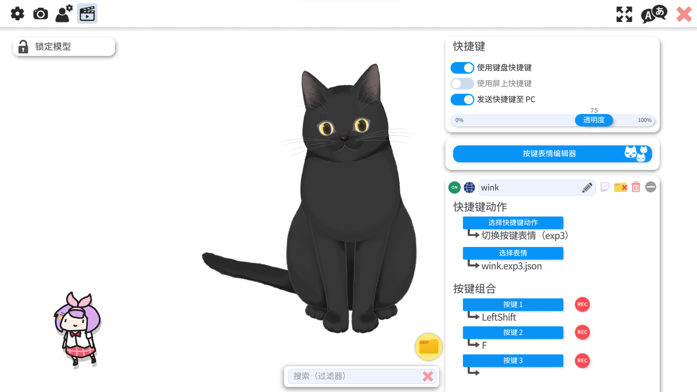

# 全自动直播服务

打算对接 Vtuber Studio 进行全自动化直播, 主要用于测试

### 安装教程
首先我们先安装好我们的 stt 语音转文字

```
wget https://github.com/jianchang512/stt/releases/download/v0.94/win-0.0.94.7z
```

然后我们需要安装好 Anaconda 并创建好环境, 之后安装 requirements.txt 内的所有内容

```
pip install -r requirements.txt
```

之后我们要去下载一个大语言模型的 GGUF 文件, 并且放到 models 文件夹下, 在下载的 model 文件夹中有 stt 的 tiny 模型

我使用的是 DeepSeek-R1-Distill-Qwen-1.5B-Q8_0.gguf，DeepSeek 1.5B 参数 Q8 量化版本

安装好弹幕管理器 blivechat，这个是 Windows x64 预编译版本，也可以使用源码编译

```
wget https://github.com/xfgryujk/blivechat/releases/download/v1.10.0/blivechat-1.10.0-windows-x64.zip
```

双击 blivechat.exe 即可，之后访问 http://localhost:12450/ 可以控制基础信息

### 系统介绍

系统以网络传输为主要信息传递的方式进行信息传递，下面是我们暂定的方案


---

1. Bert 情感分类 Api: http://127.0.0.1:81/predict, 输入 Json 数据并用 "text" 传递

2. LLM 大语言模型 Api: ws://127.0.0.1:82/ws, 这一部分有专门的 Api 控制

3. 主控制程序 Api: http://127.0.0.1:83/, 这一部分用于获取弹幕信息并控制各种 HTTP 服务

4. STT 语音转文字 Api: http://127.0.0.1:9977/api, 固定写法

---

首先我们启动我们的后端服务（后端控制服务、DeepSeek 服务、blivechat 服务、表情管理服务）

```
start.bat
```

如果想要语音到语音模式，我们还提供了 record.py 来实现交互


打开我们的 Vtuber Studio 并且录制好动作，并绑定快捷键

（注意：使用别人的模型时，一定注意查看许可授权，本项目使用的是开源免费的模型）



之后按照 obs 文档推流到 bilibili 服务器就可以了


同时和 bilibili 的弹幕交互是基于 blivechat 实现的，plugins 文件夹下有 blivechat 的开发测试

表情管理使用的是 Bert 分类模型，前往 dataset 可以查看具体内容

建议在正式使用前重新训练一个表情管理，同时尽可能保证 Vtuber Studio 能正确捕获到按键输入

使用 llama.cpp 部署 DeepSeek R1 7B 模型，编译时使用的是 CPU 版本，建议重新用 GPU 编译或者使用云服务

测试视频可查看 bilibili 链接：[自动化直播测试 https://www.bilibili.com/video/BV1UL7Wz3Eq8](https://www.bilibili.com/video/BV1UL7Wz3Eq8)

### 特别鸣谢

```
# 语音转文字项目 stt, 提供了高效的语音转文字功能
https://github.com/jianchang512/stt

# 文本转语音项目 chattts, 提供了专业的文字转语音功能
https://github.com/2noise/ChatTTS

# 大语言模型部署库 llama.cpp, 用于产生交互文本
https://github.com/ggml-org/llama.cpp

# bilibili 弹幕捕获程序, 同时可以推流到 OBS Studio
https://github.com/xfgryujk/blivechat

# 音色迁移项目，可以后续继续开发（稳定音色，同时可拓展唱歌）
https://github.com/svc-develop-team/so-vits-svc
```
